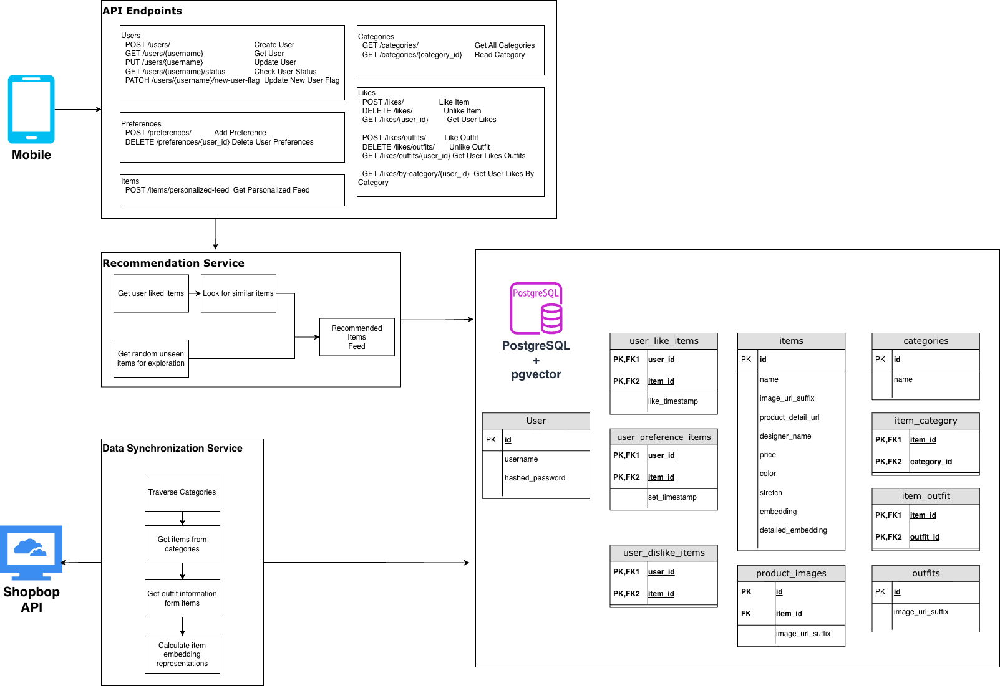

<h1 align="center">Bop-Browse</h1>
<p align="center">
  
</p>


Build a Tinder like system for matching users with Shopbop outfits that they like. Create a personalized user profile with our style quiz, and get recommendations based on your preferences. Swipe left or right on fashion items to indicate your likes and dislikes, see outfit recommendations, and manage your closet of saved items.


## Project Links

GitHub Repository: [Link](https://github.com/apatra5/Bop-Browse)

Jira Board: [Link](https://bopandbrowse.atlassian.net/jira/software/c/projects/BOB/boards/34/backlog)

Figma Design Files: [Link](https://www.figma.com/design/WDSlLE3gzCH6GXKPo6GBTR/Bop---Browse?node-id=31-2216&p=f)

Final Presentation Slides: [Link](https://www.canva.com/design/DAG6y18PvWc/xR7-dihYK3SxQ2JYhGlUJg/view?utm_content=DAG6y18PvWc&utm_campaign=designshare&utm_medium=link2&utm_source=uniquelinks&utlId=hda14f30241)

## Demo Video

https://github.com/user-attachments/assets/81b3a27d-6fa3-4084-81da-211773b21476


Download / open the demo: [Demo.mov](./Demo.mov)


### Features
- User Authentication & Profile Management
- Preference Quiz to bootstrap user profiles
- Swipe Interface for Item/Outfit Discovery, with category filters
- Closet Management to save liked items and outfits
- Recommender System using Item Embeddings to perform similarity search and generate personalized recommendations
- Data Synchronization Scripts to sync Shopbop catalog data with the database

### Next Steps
- Directional clues/tooltips for first time user onboarding
- Improve auth mechanism security
- Database query optimizations to improve recommendation latency
- Build a web frontend version for live demo deployment

## Technical Roadmap

### Architecture Diagram


### Tech Stack
- **Frontend**: React Native, Expo, TypeScript
- **Backend**: FastAPI, Python
- **Database**: PostgreSQL + pgvector (AWS RDS)
- **ORM**: SQLAlchemy
- **Database Migration**: Alembic


## Development

### Setup Instructions
```bash
cd backend
pip install -r requirements.txt
uvicorn main:app --host 0.0.0.0 --port 8000 --reload
cd ../frontend
npm install
npx expo start
```

### Backend

To run backend locally:
```bash
cd backend
uvicorn main:app --host 0.0.0.0 --port 8000 --reload
```
API docs will be available at `http://localhost:8000/docs`

### Backend Structure
```bash
backend/
├─ alembic/       # database migration 
├─ core/          # global app config
│  └─ config.py   # load env vars, DB URL
├─ crud/          # data access logic
│  └─ category.py 
│  └─ item.py 
│  └─ ...
├─ db/            # database configuration setup
│  ├─ session.py
│  └─ base.py
├─ models/        # SQLAlchemy ORM models
│  └─ __init__.py
│  └─ associations.py # many-to-many relationship tables
│  └─ category.py
│  └─ ...
├─ poc_recommender/  # proof of concept recommender system. Not used in the main app. 
│  └─ prototype.py   # Exploring different ways of representing and discovering similar items
├─ recommender/      # recommender system logic that integrates with the main app, uses user-item interactions to generate recommendations
│  └─ recommender.py
├─ routers/       # FastAPI routers
│  └─ category.py
│  └─ ...
├─ schemas/      # Pydantic models
│  └─ category.py
│  └─ ...
├─ scripts/   # data pipeline that synchronizes Shopbop catalog data with the database and prerequisites for running the app
│  └─ sync_items.py             # contains scripts to fetch all items from Shopbop and populate the database
│  └─ update_item_embeddings.py # calculates item embeddings using a pre-trained model and store them in the vector database
├─ services/    # third party API clients (Shopbop API)
├─ alembic.ini    # database migration
└─ main.py
```

#### Configurations

The backend expects a .env file placed in the backend/ folder so the application can import configuration settings at startup. The following variables are required: 
  - DATABASE_URL
 
#### Database Migration
Database migration ensures whenever we update the models, the changes can be automatically applied to the database. 

After making changes to the SQLAlchemy models, run the following scripts to sync changes to the AWS RDS database:

```bash
alembic revision --autogenerate -m "migration name (e.g. create user table)"
alembic upgrade head
```

#### Data Synchronization Scripts
To populate the database with Shopbop catalog data, run the following script:
```bash
python -m scripts.sync_items
```

To update item embeddings in the vector database, run the following script:
```bash
python -m scripts.update_item_embeddings
```


### Frontend

To run frontend locally:
```bash
cd frontend
npm i
npx expo start -> then start simulator or scan qr code with Expo Go App
```

### Frontend Structure
```bash
frontend/
├─ app/                     # App entry + route-based screens (Expo Router)
│  ├─ _layout.tsx           # Root layout for navigation, theming, and providers
│  ├─ index.tsx             # Root auth gate & redirect screen, decides where to send the user based on local auth state
│  ├─ modal.tsx             # Global modal route (e.g., overlays, dialogs)
│  ├─ (auth)/               # Auth-related routes (login, signup, etc.)
│  └─ (tabs)/               # Tab-based navigation stack (closet, outfits, profile, etc.)
│
├─ api/                     # API client setup and backend communication
│  └─ axios.js              # Preconfigured Axios instance (base URL, interceptors)
│
├─ components/              # Reusable UI + domain components
│  ├─ closet-outfit-card.tsx     # Card showing a saved outfit from the closet
│  ├─ external-link.tsx          # Styled external link component (web & native)
│  ├─ filter-dropdown.tsx        # Dropdown component for filtering items (categories, brands, etc.)
│  ├─ haptic-tab.tsx             # Tab button with haptic feedback support
│  ├─ hello-wave.tsx             # Example / decorative animated “hello” component
│  ├─ item-card.tsx              # Card for displaying a single item (image, price, actions)
│  ├─ outfit-look-card.tsx       # Card showing a full outfit look
│  ├─ parallax-scroll-view.tsx   # Scroll view with parallax header effect
│  ├─ preference-card.tsx        # Card for capturing / displaying user preferences
│  ├─ product-detail-modal.tsx   # Modal for detailed product view (images, info, actions)
│  ├─ themed-text.tsx            # Text component wired into the app’s theme
│  ├─ themed-view.tsx            # View container aware of light/dark theme
│  └─ ui/                        # Lower-level UI primitives (buttons, inputs, etc.)
│
├─ constants/
│  └─ theme.ts              # Centralized theme (colors, spacing, typography) for the app
│
├─ contexts/
│  └─ AuthContext.tsx       # React context for authentication state and actions
│
├─ data/
│  └─ mock-items.ts         # Mock item data for development/testing UI without backend
│
├─ hooks/
│  ├─ use-color-scheme.ts       # Hook: gets current color scheme on native
│  ├─ use-color-scheme.web.ts   # Web-specific variant of color scheme hook
│  └─ use-theme-color.ts        # Hook: computes themed colors for components
│
├─ assets/
│  └─ images/               # Static images (icons, logos, illustrations, etc.)
│
├─ scripts/
│  └─ reset-project.js      # Helper script to reset/clean the Expo project
│
├─ app.json                 # Expo app configuration (name, icons, splash, etc.)
├─ babel.config.js          # Babel configuration for Expo/React Native
├─ eslint.config.js         # ESLint configuration for linting the TS/JS code
├─ expo-env.d.ts            # TypeScript declarations for Expo environment variables/types
├─ package.json             # Frontend dependencies, scripts, and project metadata
├─ tsconfig.json            # TypeScript compiler configuration
└─ README.md                # Frontend-specific setup and usage instructions
```

#### Configurations

The frontend expects a .env file placed in the frontend/ folder so the application can import configuration settings at startup. The following variables are required: 
  - EXPO_PUBLIC_API_URL